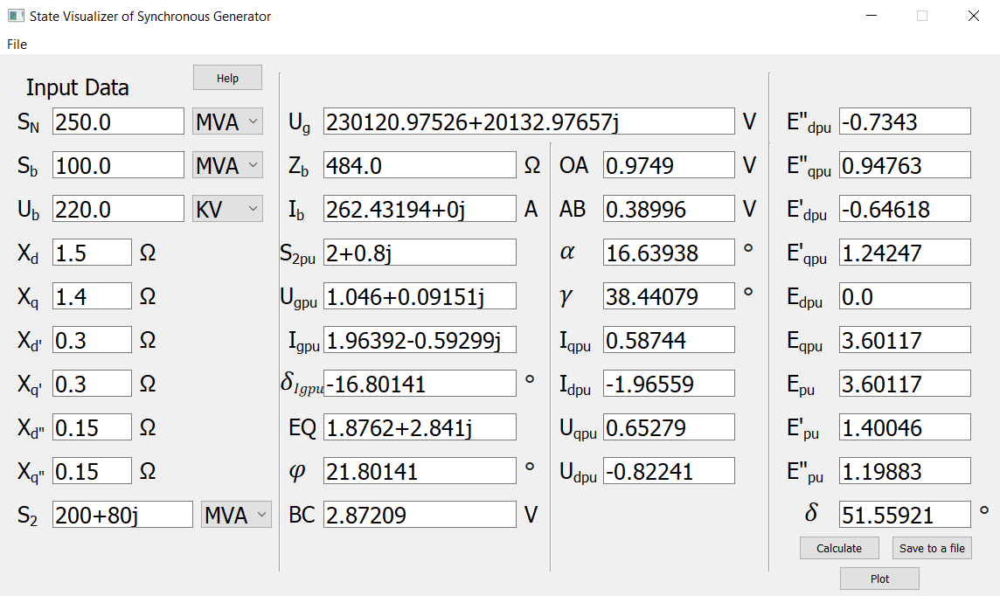
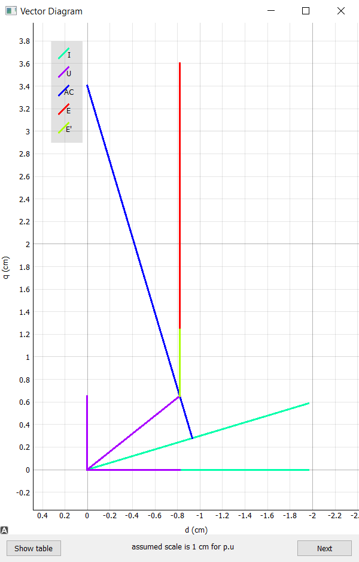
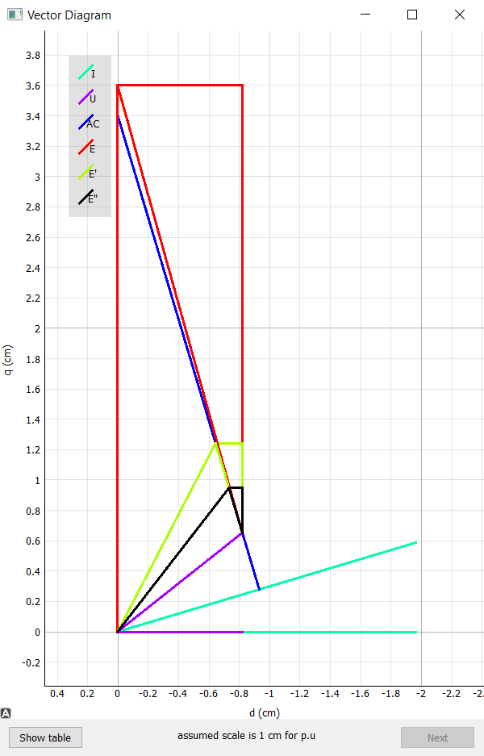
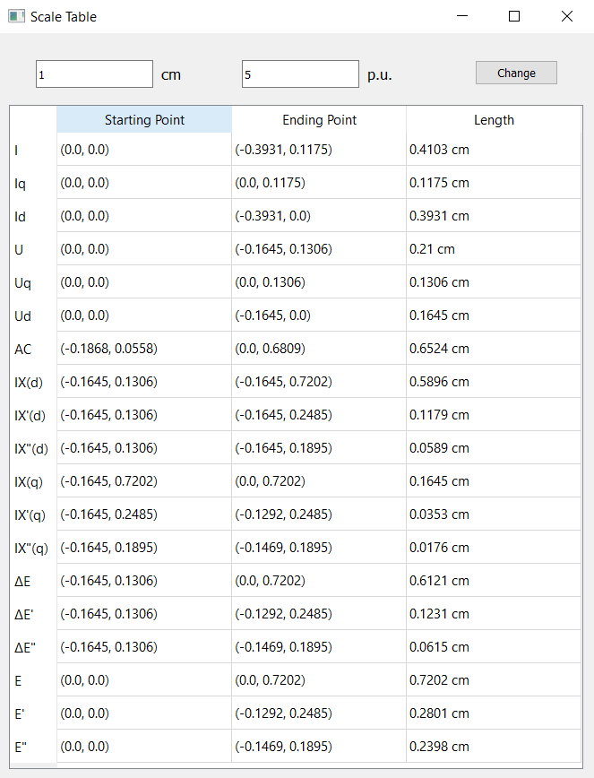

# Aplikacja do wizualizacji stanów pracy generatora synchronicznego

Plikiem odpowiedzialnym za uruchomienie okna z programem jest plik main.py

Program napisany w języku Python z wykorzystaniem biblioteki PyQt5 oraz PyQtGraph.

Pozwala m.in. nao bliczenie parametrów stanów genratora oraz rysowanie wykresu wektorowego krok po kroku.

## Ekrany aplikacji

Po uruchomieniu otwiera się ekran startowy aplikacji, gdzie można wpisać dane ręcznie, wczytać je z pliku, lub zapisać wyniki do pliku 
po wykonaniu obliczeń. 

Po wybraniu opcji plot przechodzimy do ekranu, gdzie krok po kroku rysowany jest wykres wektorowy.

  
   

Z tego ekranu można przejść do kolejnego, gdzie wyświetlane są dokładne wartości punktów na wykresie, oraz istnieje możliwość 
obliczenia nowych współrzędnych, po przeskalowaniu wykresu.

